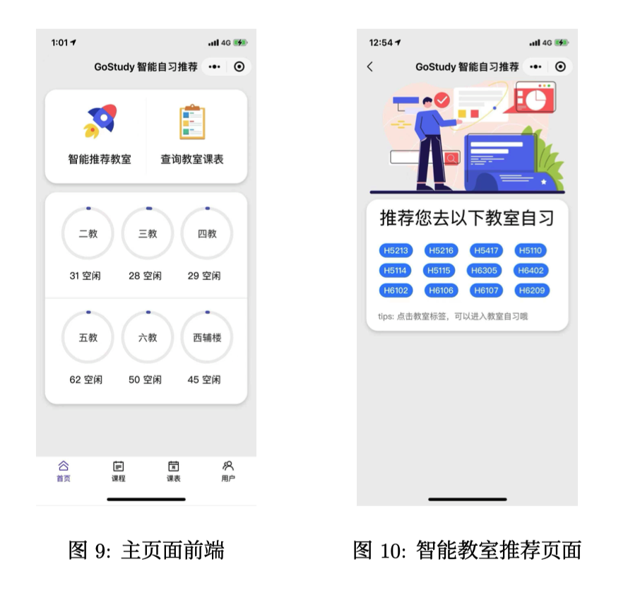
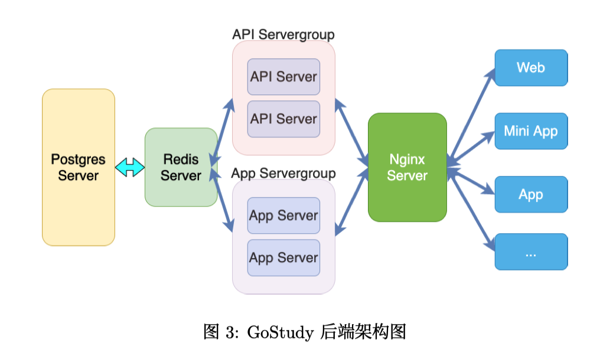

# 简介

本次课程实验我们设计编写了一个智能自习管理小程序 GoStudy，集成了一体式学习管理与自习推 荐系统。前端依托于微信小程序，使用了部分 Vant-Weapp 组件库中的前端组件进行开发；通过部 署 SSL 证书和用户 token 机制实现前后台交互的数据加密，保证用户数据安全性；后端采用 Go 语 言开发，通过 Nginx 反向代理，完成服务转发和负载均衡，通过 Gin 搭建 API Server 提供前后端交 互接口，插入数据库；在数据库层面，我们采用了 Redis 和 PostgreSql 的两级数据库部署模式，通 过 Redis 加速数据索引，以应对高并发业务场景。在部署上，我们采用了容器 (Docker) 技术，实现 了不依赖操作系统的灵活多机部署。同时我们通过 Django Admin 搭建了功能强大的数据库管理页 面，支持对于数据库中各表数据的各类操作以及可视化数据显示。

